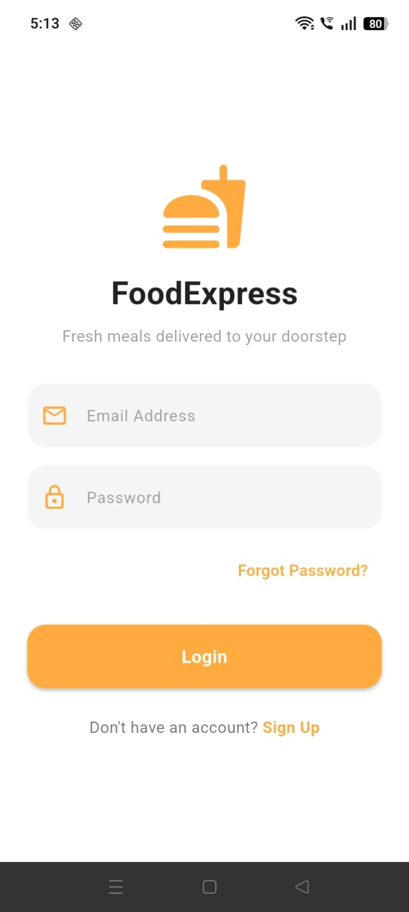
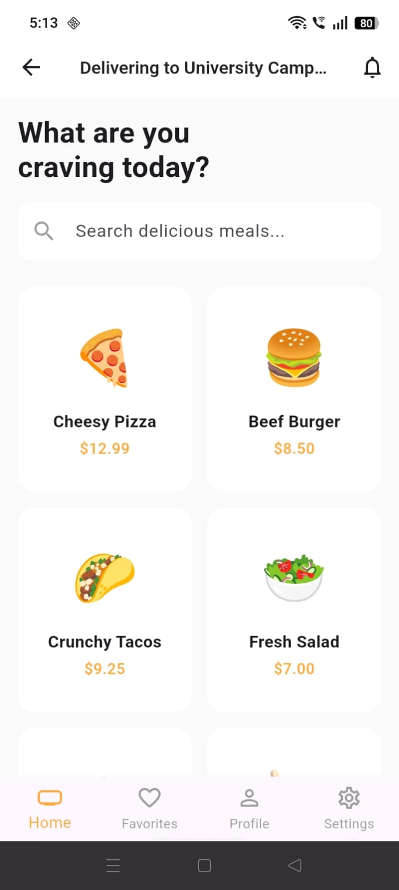
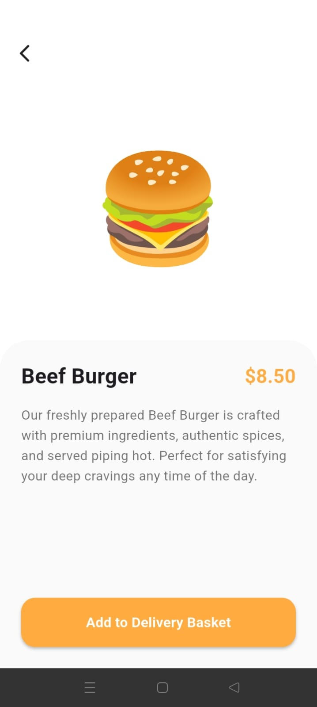

# Food Delivery App 🍔

A modern, responsive, and pixel-perfect Food Delivery UI built with Flutter. This project focuses on clean UI architecture, responsive layouts, reusable widgets, and smooth keyboard handling to deliver a seamless user experience across different screen sizes.

---

## 📱 App Gallery

|                                Login Screen                                |                                Home Screen                               |                                   Food Detail Screen                                   |
| :------------------------------------------------------------------------: | :----------------------------------------------------------------------: | :------------------------------------------------------------------------------------: |
|  |  |  |

---

## ✨ Features

* 📱 Responsive UI that adapts to different screen sizes.
* 🎨 Pixel-perfect implementation based on the provided design.
* 🍔 Beautiful food browsing interface.
* 📄 Detailed food information screen.
* 🔐 Clean and responsive login screen.
* ⌨️ Proper keyboard handling with zero overflow issues.
* ♻️ Reusable and modular widget structure.
* ⚡ Smooth navigation and optimized layouts.

---

## 🚀 Engineering Highlights

* **Responsive Layouts:** Uses `LayoutBuilder`, `Flexible`, `Expanded`, and `MediaQuery` where appropriate to create adaptive interfaces.
* **Keyboard Safety:** Implements `SingleChildScrollView` with proper `resizeToAvoidBottomInset` handling to prevent overflow when the keyboard appears.
* **Reusable Components:** UI elements are separated into reusable widgets to improve maintainability and reduce code duplication.
* **Clean Architecture:** Presentation widgets are organized separately from feature screens for better readability and scalability.
* **Flutter Best Practices:** Uses constraint-based layouts instead of fixed dimensions wherever possible.

---

## 🛠️ Tech Stack

* **Framework:** Flutter
* **Language:** Dart
* **Architecture:** Modular UI with reusable widgets
* **State Management:** Flutter's built-in state management (`setState`)

---

## 📂 Project Structure

```text
lib/
├── screens/
├── widgets/
└── main.dart
```

---

## 🚀 Getting Started

### Prerequisites

Make sure Flutter is installed.

```bash
flutter --version
```

---

### Installation

Clone the repository:

```bash
git clone https://github.com/SyedAsharRaza/HoopInternshipTask4.git
cd HoopInternshipTask4
```

Install dependencies:

```bash
flutter pub get
```

Run the application:

```bash
flutter run
```

(Optional) Run tests:

```bash
flutter test
```

---

## 📸 Screenshots

Place your screenshots inside the `screenshots/` folder:

```
screenshots/
├── login_screen.jpeg
├── home_screen.jpeg
└── food_detail_screen.jpeg
```

---

## 🤝 Contributing

Contributions, suggestions, and improvements are welcome. Feel free to fork the repository and submit a pull request.

---

## 📄 License

This project is intended for learning and portfolio purposes.

This version is ready to paste directly into your `README.md` on GitHub and should render correctly without any formatting issues.
